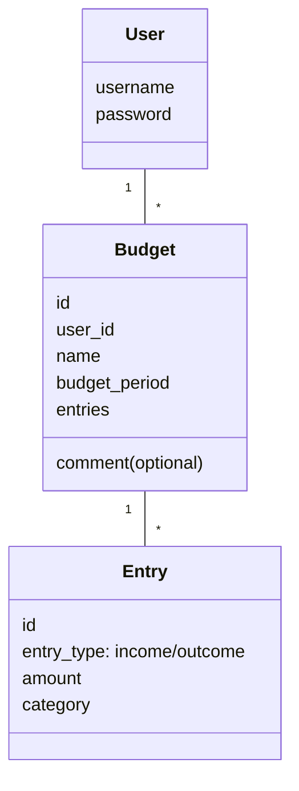

# Arkkitehtuurikuvaus
## Sovelluslogiikka
Sovelluksen loogisen tietomallin muodostavat [User](src/entities/user.py) ja [Budget](src/entities/budget.py) -luokat sekä Budgetin sisältämän Entry luokan.
Luokat kuvaavat käyttäjiä, käyttäjien budjetteja ja budjettien meno-tulo-merkintöjä.

[BudgetService](src/services/budget_service.py) vastaa budjetteihin ja tulo-meno-merkintöihin liittyvästä sovelluslogiikasta, ja tarjoaa metodeja kirjautuneelle käyttäjälle, kuten:
- `add_budget(self, name, budget_period, comment=None)`
- `delete_budget(self, index)`
- `add_entry(self, index, entry_type, amount, category)`
- `balance(self, index)`
- `filter_entries_by_category(self, category)`

[UserService](src/services/user_service.py) vastaa käyttäjiin liittyvistä toiminnallisuuksista, kuten rekisteröityminen ja kirjautuminen:
- `login(self, username: str, password: str)`
- `register(self, username: str, password: str)`

_BudgetService_ käyttää tietojen pysyväistallennukseen [BudgetRepository](src/repositories/budget_repository.py) -luokkaa ja _UserService_ käyttää [UserRepository](src/repositories/user_repository.py) -luokkaa.

