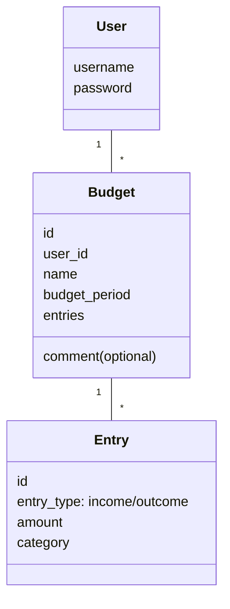

# Arkkitehtuurikuvaus
## Sovelluslogiikka
Sovelluksen loogisen tietomallin muodostavat **User** ja **Budget** -luokat sekä Budgetin sisältämän **Entry** luokan.
Luokat kuvaavat käyttäjiä, käyttäjien budjetteja ja budjettien meno-tulo-merkintöjä.

**BudgetService** vastaa budjetteihin ja tulo-meno-merkintöihin liittyvästä sovelluslogiikasta, ja tarjoaa metodeja kirjautuneelle käyttäjälle, kuten:
- `add_budget(self, name, budget_period, comment=None)`
- `delete_budget(self, index)`
- `add_entry(self, index, entry_type, amount, category)`
- `balance(self, index)`
- `filter_entries_by_category(self, category)`

**UserService** vastaa käyttäjiin liittyvistä toiminnallisuuksista, kuten rekisteröityminen ja kirjautuminen:
- `login(self, username: str, password: str)`
- `register(self, username: str, password: str)`

BudgetService käyttää tietojen pysyväistallennukseen *BudgetRepository* -luokkaa ja UserService käyttää *UserRepository* -luokkaa.

