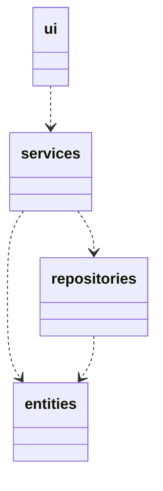
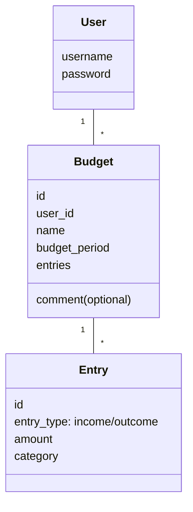
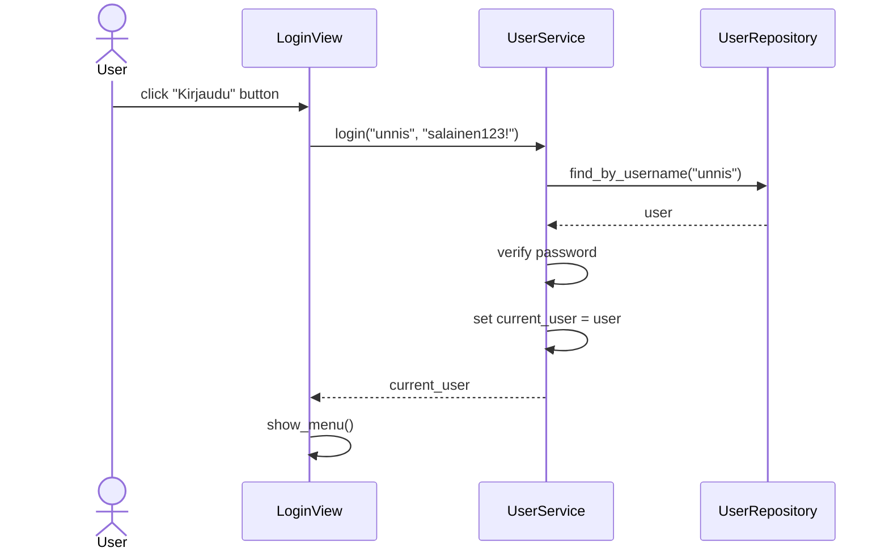
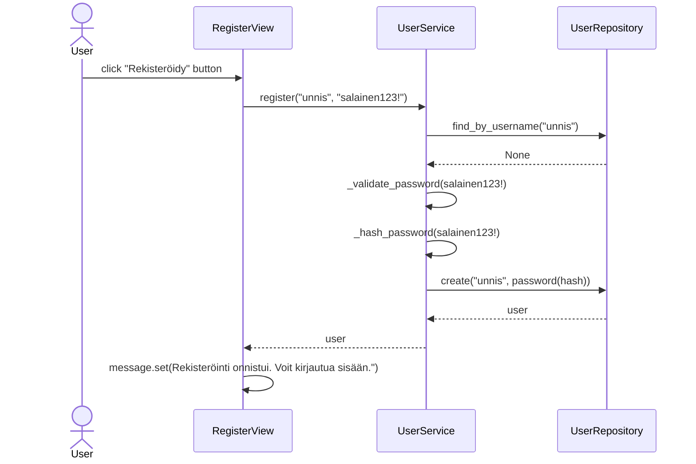
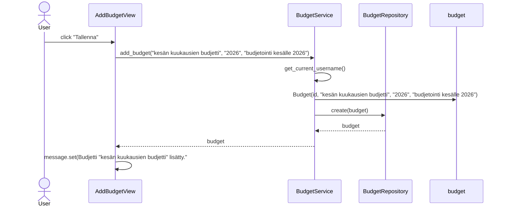

# Arkkitehtuurikuvaus
## Rakenne
Sovelluksen rakenne noudattaa kerrosarkkitehtuuria: _ui_ vastaa käyttöliittymästä, _services_ sovelluslogiikasta ja _repositories_ tietojen pysyväistallennuksesta. _Entities_ sisältää luokat  **User**, **Entry** ja **Budget**, jotka kuvaavat sovelluksen käyttämiä tietokohteista. Koodin pakkausrakenne on seuraava:

## Käyttöliittymä
Käyttöliittymä sisältää kolme päänäkymää:
- Kirjautuminen

- Rekisteröityminen

- Etusivu (main)

Etusivun alta avautuu viisi näkymää:
- Lisää budjetti

- Lisää tulo/meno

- Listaa budjetit

- Etsi budjetti tulon tai menon kategorian perusteella

- Kirjaudu ulos

"Listaa budjetit" kohdasta voi avata budjetin tiedot, jonka jälkeen voi muokata budjettia tai poistaa budjetin:

Muokkaa budjettia:

Näkymiä on yhteensä 9, joista jokainen on toteutettu omana luokkanaan. Näkymistä yksi on aina kerrallaan näkyvissä, ja näyttämisestä vastaa _ui_-luokka. Käyttöliittymä on pyritty eristyttämään sovelluslogiikasta.

## Sovelluslogiikka
Sovelluksen loogisen tietomallin muodostavat **User** ja **Budget** -luokat sekä Budgetin sisältämän **Entry** luokan.
Luokat kuvaavat käyttäjiä, käyttäjien budjetteja ja budjettien meno-tulo-merkintöjä.

**BudgetService** vastaa budjetteihin ja tulo-meno-merkintöihin liittyvästä sovelluslogiikasta, ja tarjoaa metodeja kirjautuneelle käyttäjälle, kuten:
- `add_budget(self, name, budget_period, comment=None)`
- `delete_budget(self, index)`
- `add_entry(self, index, entry_type, amount, category)`
- `balance(self, index)`
- `filter_entries_by_category(self, category)`

**UserService** vastaa käyttäjiin liittyvistä toiminnallisuuksista, kuten rekisteröityminen ja kirjautuminen:
- `login(self, username: str, password: str)`
- `register(self, username: str, password: str)`

BudgetService käyttää tietojen pysyväistallennukseen *BudgetRepository* -luokkaa ja UserService käyttää *UserRepository* -luokkaa.

## Päätoiminnallisuus
Kuvataan Budjetti-sovelluksen toimintalogiikan päätoiminnallisuuksia sekvenssikaavioilla.

Kun sovellus aukeaa, jos käyttäjällä on jo käyttäjätunnus, hän voi täyttää suoraan tiedot käyttäjätunnukseen ja salasanaan ja painaa napista "kirjaudu", tai rekisteröityä sivun vasemmasta alakulmasta napista "rekisteröidy", joka vie rekisteröitymissivulle.

Tarkastellaan ensin käyttäjän kirjautumista:

### Käyttäjän kirjautuminen

### Käyttäjän rekisteröiminen (uusi käyttäjätunnus)
Kun halutaan rekisteröidä uusi käyttäjä, painetaan ensiksi avautuvan kirjautumissivun vasemmassa alareunassa nappia "Rekisteröidy", joka vie rekisteröitymissivulle, jossa tapahtuu seuraavaa:

### Budjetin luominen
Kun halutaan luoda uusi budjetti, painetaan napista "Luo budjetti", jonka jälkeen tapahtuu seuraava:

