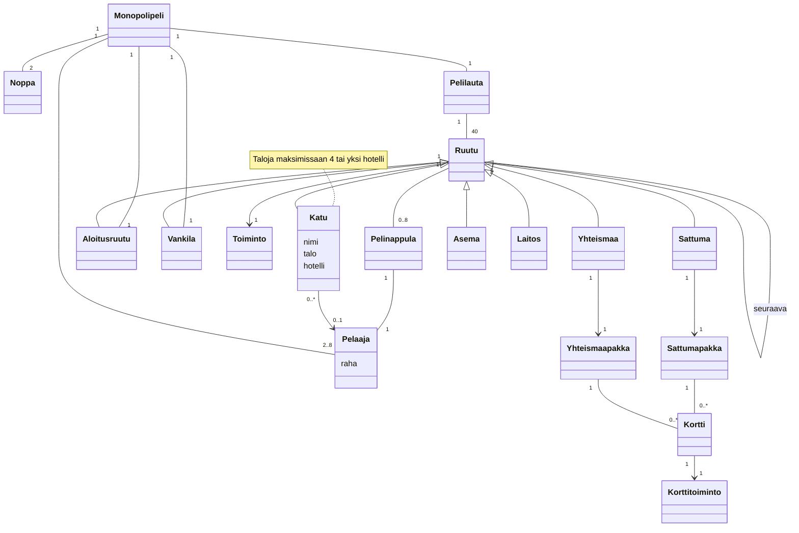

## Monopoli

```mermaid
 classDiagram
    Monopolipeli "1" -- "2" Noppa
    Monopolipeli "1" -- "1" Pelilauta
    Pelilauta "1" -- "40" Ruutu
    Ruutu "1" -- "1" Ruutu : seuraava
    Ruutu "1" -- "0..8" Pelinappula
    Pelinappula "1" -- "1" Pelaaja
    Pelaaja "2..8" -- "1" Monopolipeli

    Monopolipeli "1" -- "1" Aloitusruutu
    Monopolipeli "1" -- "1" Vankila

    Ruutu "1" --> "1" Toiminto
    Ruutu <|-- Aloitusruutu
    Ruutu <|-- Vankila
    Ruutu <|-- Sattuma
    Ruutu <|-- Yhteismaa
    Ruutu <|-- Asema
    Ruutu <|-- Laitos
    Ruutu <|-- Katu

    class Katu {
      nimi
      talo
      hotelli
    }

    note for Katu "Taloja maksimissaan 4 tai yksi hotelli"

    Katu "0..*" --> "0..1" Pelaaja
    class Pelaaja {
      raha
    }

    Sattuma "1" --> "1" Sattumapakka
    Yhteismaa "1" --> "1" Yhteismaapakka
    Sattumapakka "1" -- "0..*" Kortti
    Yhteismaapakka "1" -- "0..*" Kortti
    Kortti "1" --> "1" Korttitoiminto
```
